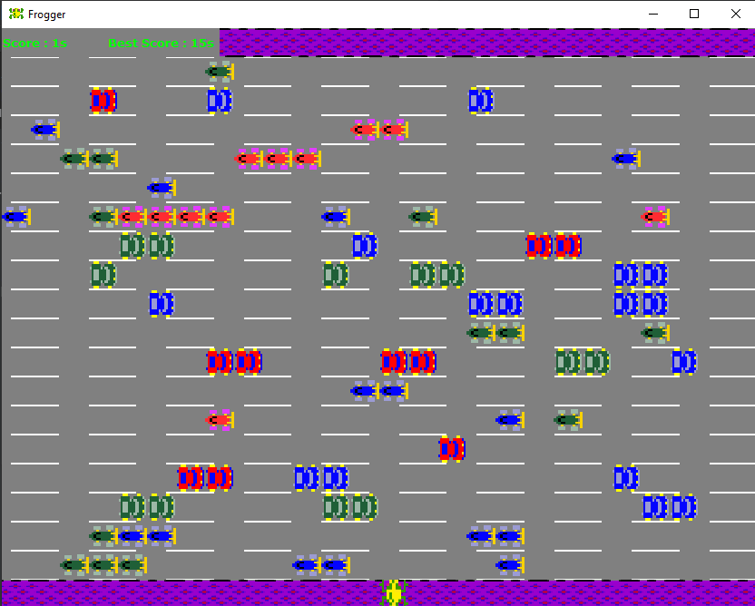
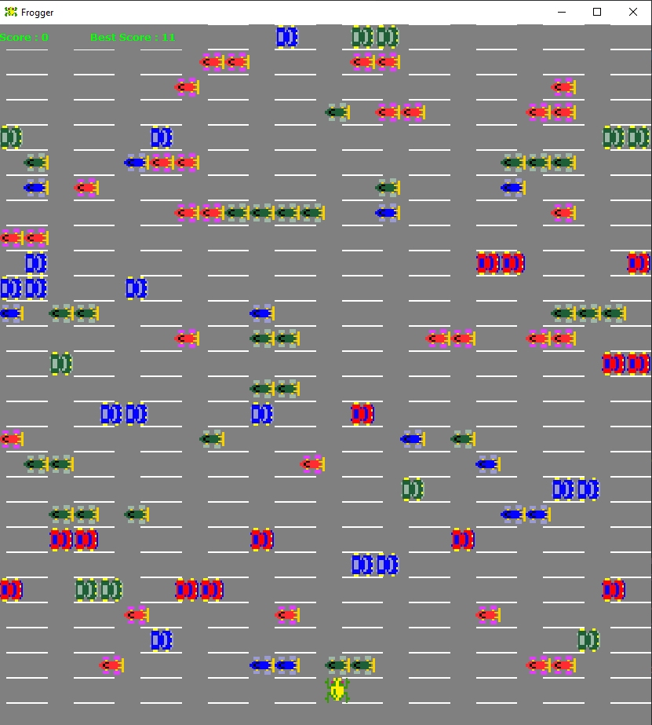
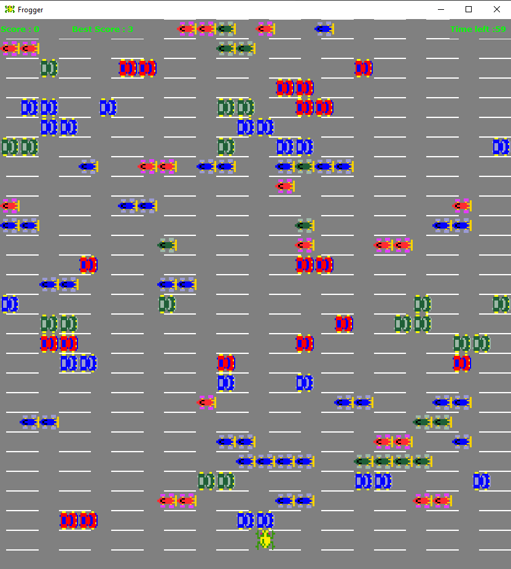
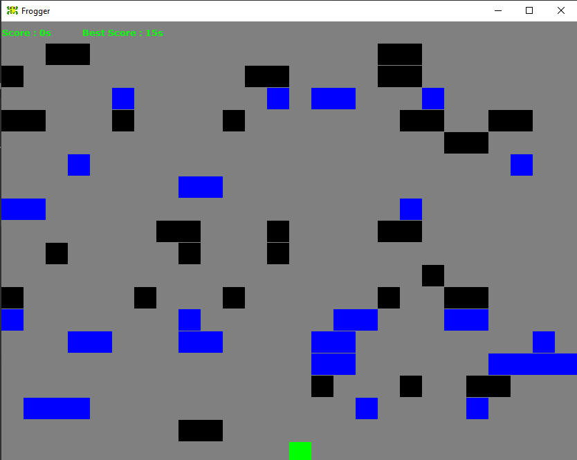
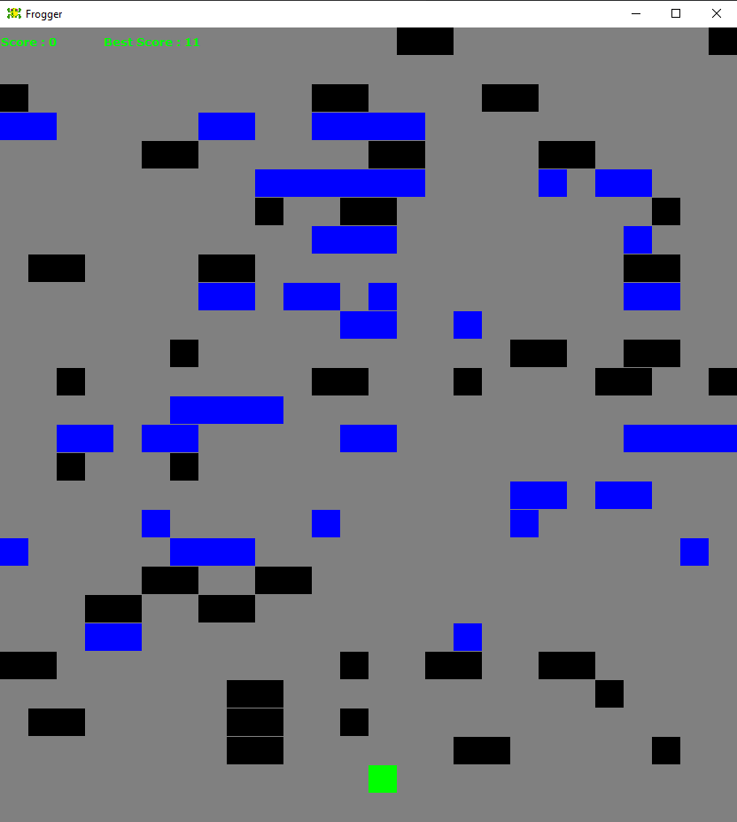
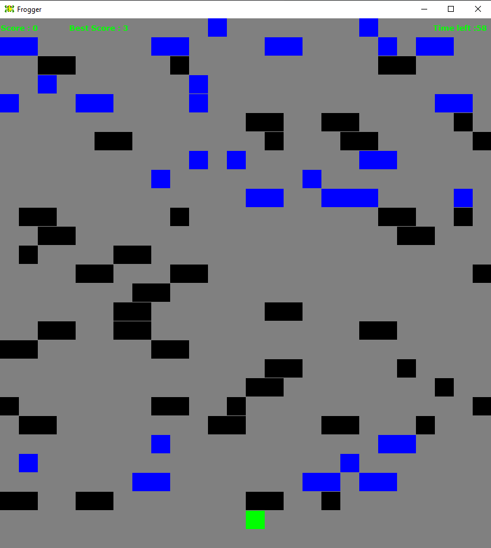
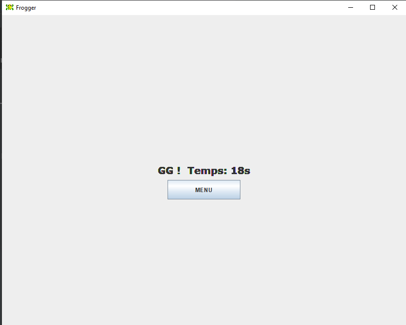
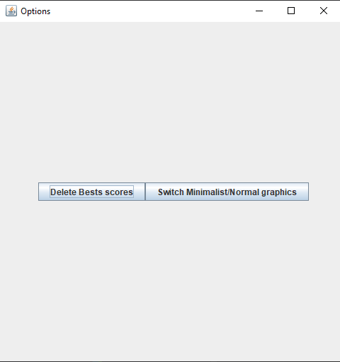

# projetFrogger

Il s'agit du jeu basé sur le jeu Frogger de Konami (1981).
Ce programme est mon projet de fin de 1er semestre de L2 Informatique à L'Université Paris-Saclay.
`2020` - `Java`, `Swing`, `IntelliJ`, `Jeu`

## Menu

## Mode Classique

## Mode Infini

## Mode Inifini Contre-la-montre

## Mode Classique Minimaliste

## Mode Infini Minimaliste

## Mode Inifini Contre-la-montre Minimaliste

## Ecran de Fin

## Options

